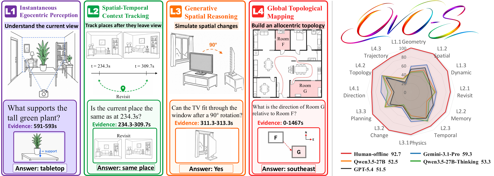
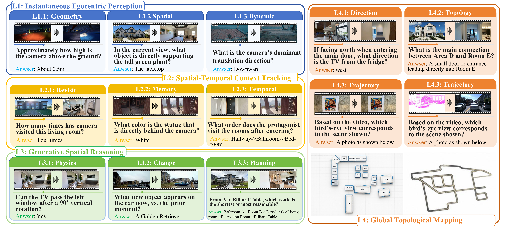
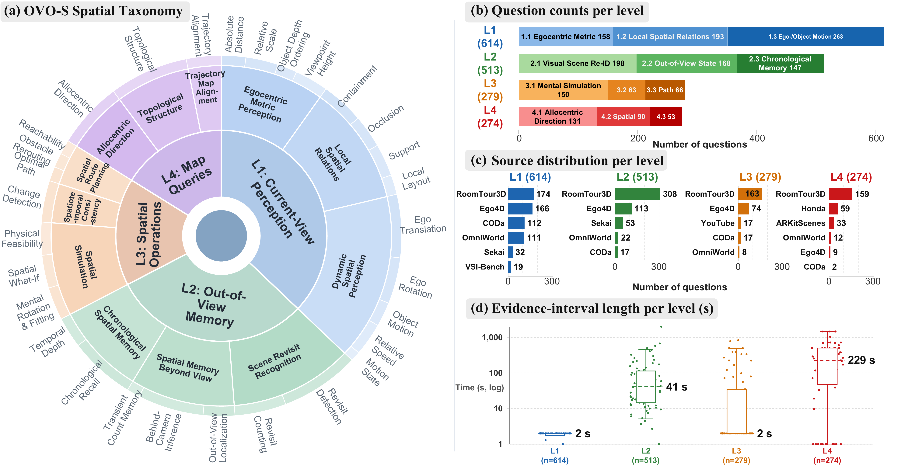

<h1 align="center">OVO-S-Bench</h1>

<p align="center">
  <em>A Hierarchical Benchmark for Streaming Spatial Intelligence in Multimodal LLMs</em>
</p>

<p align="center">
  <a href="https://joeleelyf.github.io/">Yifei Li</a><sup>1,2,†</sup> &nbsp;·&nbsp;
  Pengyiang Liu<sup>3,†</sup> &nbsp;·&nbsp;
  <a href="https://scholar.google.com/citations?hl=en&user=hW23VKIAAAAJ">Yuhang Zang</a><sup>2,*</sup> &nbsp;·&nbsp;
  Zhongyue Shi<sup>3</sup> &nbsp;·&nbsp;
  Qi Fu<sup>3</sup> &nbsp;·&nbsp;
  Hongye Hao<sup>3</sup> &nbsp;·&nbsp;
  <a href="https://scholar.google.com/citations?hl=en&user=TN8uDQoAAAAJ">Jiwen Lu</a><sup>1</sup>
</p>

<p align="center">
  <sup>1</sup>Tsinghua University &nbsp;&nbsp; <sup>2</sup>Shanghai AI Laboratory &nbsp;&nbsp; <sup>3</sup>Beihang University<br/>
  <sup>†</sup>Equal Contribution &nbsp;&nbsp; <sup>*</sup>Project Leader
</p>

<p align="center">
  <a href="https://arxiv.org/abs/2606.03890"></a>
  <a href="https://arxiv.org/pdf/2606.03890"></a>
  <a href="https://github.com/InternLM/OVO-S-Bench"></a>
  <a href="https://huggingface.co/papers/2606.03890"></a>
  <a href="https://modelscope.cn/datasets/JoeLeelyf/OVO-S-Bench/"></a>
  <a href="https://internlm.github.io/OVO-S-Bench/"></a>
</p>

<p align="center">
  
</p>

<p align="center">
  <em><b>Overview of OVO-S-Bench.</b> The benchmark evaluates streaming spatial understanding across four levels, from instantaneous egocentric perception and spatiotemporal context tracking to generative spatial reasoning and global topological mapping. The right panel summarizes representative model behavior across task families.</em>
</p>

---

## Abstract

Multimodal agents in robotics, AR, and autonomous driving must reason about places and layouts from continuous egocentric streams, often using evidence outside the current view. Existing benchmarks either evaluate offline over full videos or target events rather than spatial structure. We introduce **OVO-S-Bench**, a fully human-annotated benchmark for streaming spatial intelligence, comprising **1,680 questions over 348 source videos**. Annotation involves 12 trained annotators (each also serving as a blind cross-reviewer) across roughly **804 person-hours** of multi-round quality assurance. Each question carries a query timestamp and an evidence interval, and at evaluation, the model sees only the prefix preceding the query. Questions span four levels of increasing abstraction: instantaneous egocentric perception, spatiotemporal context tracking, spatial simulation and reasoning, and allocentric mapping. Across **38 proprietary and open-source MLLMs**, Gemini-3.1-Pro trails human experts by **27 points (59.2 vs. 86.6)**, with allocentric mapping as the dominant bottleneck. Notably, streaming and spatially fine-tuned MLLMs underperform their own backbones. We further find that chain-of-thought reasoning amplifies spatial errors when ungrounded in the stream. By exposing these limitations, OVO-S-Bench establishes a demanding testbed for next-generation streaming spatial MLLMs.

## Four-Level Streaming Spatial Taxonomy

OVO-S-Bench organizes questions into **four cumulative levels** by the spatial state a model must access at query time. The progression goes from evidence directly available in the current view to allocentric map queries that require cross-viewpoint integration, reflecting a gradient of persistence and abstraction.

| Level | Capability | Task families |
| --- | --- | --- |
| **L1 — Instantaneous Egocentric Perception** | Answerable from frames near the query timestamp alone, without recalling any past observation | egocentric metric perception (distance, scale, clearance, viewpoint height) · local spatial relations (containment, occlusion, support, visible layout) · dynamic spatial perception (camera motion, object motion, relative speed) |
| **L2 — Spatiotemporal Context Tracking** | Evidence has appeared in the prefix but is no longer visible at query time | scene revisit recognition · spatial memory beyond the view · chronological spatial memory |
| **L3 — Spatial Simulation and Reasoning** | Operate on spatial structure rather than merely retrieve an observation | spatial simulation (reorientation, removal consequences, physical feasibility) · spatiotemporal consistency verification · spatial route planning |
| **L4 — Allocentric Spatial Mapping** | Integrate the egocentric stream into an allocentric representation and query its global structure | allocentric direction reasoning · topological structure reasoning · **trajectory-map alignment** (image options) |

The released benchmark comprises **1,680 questions over 348 source videos from 9 datasets**, organized into **30 canonical task types** across four levels. Mean prefix at query time: **8.8 min**. Evidence-span medians by level: **L1 2.0 s · L2 36.8 s · L3 2.0 s · L4 278.7 s** — reflecting the spatial persistence each level demands.

<p align="center">
  
</p>

<p align="center">
  <em><b>Representative OVO-S-Bench examples.</b> Each card pairs a spatial question with visual evidence, illustrating the progression from current-view perception to allocentric mapping.</em>
</p>

<p align="center">
  
</p>

<p align="center">
  <em><b>Taxonomy and benchmark statistics.</b> Left: four-level spatial taxonomy. Right: task-family counts, source distribution, and evidence-interval lengths by level.</em>
</p>

> L4.3 trajectory-matching questions ship their option images **embedded inline** as base64 data URIs in the parquet's `options` column. No separate image-asset download is needed.

## Benchmark Construction

- **Video sources.** OVO-S-Bench draws from 9 publicly available or accessible sources covering five regimes: *indoor walkthroughs* (RoomTour3D), *egocentric activities* (Ego4D), *outdoor/world scenes* (Sekai, OmniWorld, YouTube walking tours), *driving videos* (CODa, Honda HDD), and *spatially annotated 3D environments* (ARKitScenes, VSI-Bench).
- **Human annotators write every item.** Annotators with 3D-vision backgrounds choose clips with stable motion, clear viewpoints, and enough spatial variation for the target level. For each item, they record the video, task label, question, options, answer, query timestamp, and evidence interval.
- **Each item follows the streaming setting.** The answer must be derivable from the video prefix before the query timestamp. Annotators mark the shortest interval that contains the needed evidence and write distractors that are plausible under the visual context but wrong under the annotated evidence.
- **Quality control removes shortcuts.** A text-only LLM probe flags items that leak the answer through wording, common sense, or option asymmetry. A second annotator then cross-reviews each item without seeing the original answer, checking that the answer and evidence interval are sufficient. Recurring problems are folded back into the annotation guideline.

## Key Findings

Six observations about the current state of streaming spatial intelligence, from 38 evaluated systems on OVO-S-Bench:

| | Finding |
| :-: | --- |
| **27 pts** | **Significant gap with human performance.** Strongest system **Gemini-3.1-Pro** reaches **59.2** overall, far below human experts under the same streaming protocol (**86.6**; **92.2** offline). Best open-source: **Qwen3-VL-235B-A22B** at **53.6**, trailing human-streaming by **33 points**. The Random (31.3) and Text-Only (37.1) baselines fall below all general backbones, confirming the gap reflects genuine visual-streaming difficulty rather than language priors. |
| **28 / 34** | **Allocentric mapping is the dominant bottleneck.** L4 is the lowest-scoring level for **28 of 34** systems, with an average gap of **9.3 %** between L1–L3 and L4. Even the largest open-source backbones drop more than 10 points (Qwen3-VL-235B-A22B: 10.6; InternVL-3.5-241B-A28B: 13.8). The six exceptions all have L1 below 41, so their flipped ordering reflects degraded current-view perception rather than competent allocentric mapping. |
| **+5.6** | **Closed-source advantage is narrow and uneven.** The closed-source lead is only **5.6 points overall** (Gemini-3.1-Pro 59.2 vs Qwen3-VL-235B-A22B 53.6), narrower than the 10+ point gap reported on recent video and multimodal benchmarks. The gap is uneven across levels: it widens on memory-heavy L2 (**+5.9**) and narrows on L4 (**+4.1**); on L3, the best open-source backbone **exceeds Gemini-3.1-Pro by 5.3 points** (61.2 vs 55.9). |
| **13 / 15** | **Specialization hurts the backbone.** No streaming-architecture or spatially fine-tuned variant outperforms its comparable general backbone, and **13 of 15** lag behind their own base on overall accuracy (median −2.0, range −18.4 to +0.5). **L4 is the most uniformly damaged level**: 13 of 15 methods regress on allocentric mapping (mean Δ = −6.1; Flash-VStream-7B −16.7, Cosmos-Reason1-7B −12.8). |
| **+3.9 / −1.0** | **Chain-of-thought is double-edged.** Across paired thinking-mode comparisons, explicit reasoning consistently helps L2 (mean Δ = **+3.9**, 8/9 pairs positive) but shows a small mean drop on L1 (mean Δ = **−1.0**, 6/9 pairs negative). A GPT-5.4 judge over wrong traces finds that **60–80 % of CoT failures are mis-grounded visual evidence** (non-visual + visual-content errors) in GLM-4.6V-Flash, Qwen3-VL, and InternVL-3.5. |
| **r ≈ 0** | **Retention is not the bottleneck.** For HERMES, StreamingTOM, and FluxMem, per-query Pearson correlation between Evidence Recall and correctness is essentially zero (**r ∈ [−0.07, 0.00]**). Neither an oracle-evidence sampler nor doubling the frame budget improves over uniform 128 frames by more than +0.3 points. The 27-point gap to human performance therefore **does not reduce to a retrieval problem** solvable by better frame selection or larger memory. |

---

## Leaderboard

Main results under the streaming protocol (multiple-choice accuracy). Numbers replicated from the paper's main results table. The public dataset release is linked above; a live submission portal will follow.

| Model | Params | L1 | L2 | L3 | L4 | Overall | Rank |
| --- | :-: | :-: | :-: | :-: | :-: | :-: | :-: |
| *Baselines & Controls* | | | | | | | |
| Random Baseline | – | 29.8 | 35.1 | 33.3 | 27.1 | 31.3 | – |
| Text-Only (GPT-5.4) | – | 38.4 | 35.6 | 38.9 | 35.5 | 37.1 | – |
| Human (streaming) | – | 93.2 | 81.0 | 86.4 | 79.2 | **86.6** | – |
| Human (offline) | – | 97.0 | 86.2 | 94.2 | 89.2 | **92.2** | – |
| *Closed-source proprietary MLLMs* | | | | | | | |
| **Gemini-3.1-Pro** | – | **61.9** | **64.0** | 55.9 | **54.9** | **59.2** | 🥇 1 |
| GPT-5.4 | – | 54.6 | 57.6 | 50.8 | 40.5 | 50.9 | 5 |
| Gemini-3.1-Flash-Lite | – | 54.1 | 52.2 | 54.1 | 42.8 | 50.8 | 7 |
| Grok-4.1-Fast | – | 44.8 | 46.6 | 48.5 | 35.0 | 43.7 | 19 |
| *Open-source general video MLLMs* | | | | | | | |
| **Qwen3-VL** | 235B-A22B | 52.5 | 55.2 | **61.2** | 45.7 | 53.6 | 🥈 2 |
| Qwen3.5 | 397B-A17B | 49.6 | 55.4 | 58.1 | 45.4 | 52.1 | 🥉 3 |
| Qwen3.5 | 27B | 51.5 | 55.2 | 52.4 | 47.7 | 51.7 | 4 |
| InternVL-3.5 | 241B-A28B | 55.6 | 55.7 | 51.6 | 40.5 | 50.9 | 6 |
| InternVL-3.5 | 38B | 54.7 | 54.4 | 45.5 | 41.9 | 49.1 | 8 |
| Qwen3-VL | 32B | 50.1 | 51.9 | 51.9 | 41.2 | 48.8 | 9 |
| Qwen3-VL | 4B | 43.3 | 48.2 | 54.5 | 41.4 | 46.8 | 10 |
| Qwen3.5 | 9B | 47.5 | 49.4 | 50.2 | 36.6 | 45.9 | 12 |
| Qwen3.5 | 4B | 45.4 | 48.2 | 49.3 | 38.7 | 45.4 | 13 |
| InternVL-3.5 | 8B | 45.9 | 45.8 | 47.2 | 39.3 | 44.6 | 16 |
| Qwen2.5-VL | 7B | 40.7 | 45.5 | 45.9 | 44.7 | 44.2 | 17 |
| GLM-4.6V-Flash | 9B | 44.6 | 48.0 | 46.6 | 33.8 | 43.2 | 22 |
| Gemma-4 | 26B-A4B | 49.3 | 46.6 | 45.0 | 29.3 | 42.6 | 24 |
| Gemma-4 | E4B | 40.9 | 42.8 | 42.8 | 32.3 | 39.7 | 30 |
| Gemma-4 | E2B | 38.8 | 36.5 | 39.3 | 29.6 | 36.1 | 36 |
| *Streaming video MLLMs* | | | | | | | |
| StreamForest | 7B | 46.6 | 45.2 | 49.7 | 34.9 | 44.1 | 18 |
| StreamingVLM | 7B | 38.7 | 50.5 | 41.8 | 41.2 | 43.0 | 23 |
| Flash-VStream | 7B | 18.7 | 29.9 | 22.5 | 28.7 | 24.9 | 38 |
| *Token-compression and memory-based methods* | | | | | | | |
| FluxMem | 7B | 43.0 | 47.6 | 45.5 | 42.6 | 44.7 | 14 |
| HERMES | 7B | 40.9 | 45.4 | 49.4 | 42.9 | 44.6 | 15 |
| StreamingTOM | 7B | 37.2 | 48.2 | 38.7 | 33.5 | 39.4 | 31 |
| InfiniPot-V | 7B | 39.1 | 35.7 | 41.9 | 40.6 | 39.3 | 32 |
| *Spatially fine-tuned MLLMs* | | | | | | | |
| VST-7B-SFT | 7B | 43.3 | 44.0 | 43.6 | 37.9 | 42.2 | 26 |
| VST-7B-RL | 7B | 45.7 | 44.2 | 40.9 | 38.0 | 42.2 | 25 |
| SenseNova-SI-1.5 | 8B | 42.1 | 42.4 | 42.7 | 32.8 | 40.0 | 29 |
| Spatial-TTT | 2B | 38.7 | 35.4 | 41.0 | 32.7 | 37.0 | 33 |
| Cambrian-S | 7B | 40.2 | 40.0 | 36.9 | 29.9 | 36.8 | 34 |
| Spatial-MLLM | 7B | 35.7 | 39.2 | 34.4 | 36.3 | 36.4 | 35 |
| Cambrian-S-LFP | 7B | 38.8 | 38.0 | 34.2 | 28.7 | 34.9 | 37 |
| *Embodied foundation models* | | | | | | | |
| RynnBrain | 8B | 45.3 | 50.3 | 47.3 | 42.7 | 46.4 | 11 |
| VeBrain | 7B | 42.7 | 44.2 | 46.2 | 40.8 | 43.5 | 21 |
| RoboBrain2.5-NV | 8B | 42.9 | 46.6 | 50.6 | 34.1 | 43.6 | 20 |
| RoboBrain2.5 | 4B | 40.1 | 43.4 | 48.1 | 35.7 | 41.8 | 27 |
| Cosmos-Reason1 | 7B | 44.8 | 43.7 | 45.5 | 31.9 | 41.5 | 28 |

Interactive version with sorting + per-category drill-down: <https://internlm.github.io/OVO-S-Bench/>

---

## Quick Start

### Install

```bash
git clone https://github.com/InternLM/OVO-S-Bench.git
cd OVO-S-Bench

# Default install (API providers only; ~1 min)
pip install -r requirements.txt

# Optional: open-source MLLMs via vLLM
pip install -r requirements-vllm.txt
```

### Download the benchmark

The release pages are:

- Hugging Face: <https://huggingface.co/datasets/JoeLeelyf/OVO-S-Bench>
- ModelScope: <https://modelscope.cn/datasets/JoeLeelyf/OVO-S-Bench/>

The complete annotations parquet and source videos are currently available from ModelScope:

```bash
pip install -U modelscope
python - <<'PY'
from modelscope.hub.snapshot_download import snapshot_download

snapshot_download(
    repo_id='JoeLeelyf/OVO-S-Bench',
    repo_type='dataset',
    local_dir='./data',
)
PY
```

Layout you should see after download:

```
data/
├── ovo_s_bench.parquet     # questions, ~35 MB
└── videos/                       # source .mp4 files
    ├── Ego4D/ ...
    ├── RoomTour3D/ ...
    ├── annotated_videos/ ...
    └── ...
```

### Configure API keys

```bash
cp .env.example .env
$EDITOR .env       # fill in the provider(s) you'll use
```

### Run

**API model** (single-process, threaded):

```bash
bash scripts/eval_api.sh gpt-4o data/ovo_s_bench.parquet
```

**Open-source MLLM via vLLM** (multi-GPU auto-sharded; default 128 uniformly-sampled frames per prefix):

```bash
GPUS=8 bash scripts/eval_vllm.sh qwen3-vl-32b data/ovo_s_bench.parquet
```

Both scripts call `inference.py` then `score.py`. Inference auto-resumes on rerun — interrupted jobs pick up from the last checkpoint.

### Add a new model

See [docs/adding_models.md](docs/adding_models.md). The contract is `BaseModel.inference(frames: List[PIL.Image], prompt: str) -> str`; add a config entry to `config.yaml::MODELS` and register the wrapper in `models/api_models.py` or `models/vllm_models.py`.

### Custom API endpoint

Set `*_BASE_URL` in `.env` to point at your proxy or local vLLM server. API providers (`openai`, `gemini-native`, `anthropic`) honor the standard `*_BASE_URL` env var convention.

---

## Evaluation Protocol

All systems are evaluated under a **unified streaming protocol**: each source video is truncated at the annotated query timestamp $t_q$, and the model receives **128 frames uniformly sampled from the resulting prefix** together with the question and multiple-choice options. For streaming-architecture models that implement a native sequential ingestion path, we instead feed the video at each model's published streaming rate and query the resulting compressed state. No model sees frames after $t_q$. Answers are extracted by regular expression without further post-processing.

Per-query responses land under `results/<model>/ovo_s_bench.json`. `score.py` aggregates accuracy by main category and subcategory:

```bash
python score.py --result results/gpt-4o/ovo_s_bench.json --verbose
```

For sharded multi-GPU runs, `merge_results.py` consolidates `*_rank{N}.json` shards into a single result file (auto-invoked by `launch.py`).

---

## Repository Layout

```
OVO-S-Bench/
├── inference.py            # Main eval entry point
├── score.py                # Per-category accuracy aggregator
├── launch.py               # Multi-GPU dynamic-sharding launcher (auto-merges)
├── precache.py             # CPU-only frame pre-extraction
├── merge_results.py        # Shard merger
├── prompts.py              # Pluggable prompt templates (default/verbose/cot)
├── annotation_utils.py     # Parquet / JSON annotation loader
├── option_utils.py         # Image-option helpers (L4.3 PNG decoding)
├── config.yaml             # 84+ pre-registered model entries
├── models/
│   ├── base.py             # BaseModel ABC
│   ├── api_models.py       # OpenAI / Gemini / Claude
│   ├── vllm_models.py      # Qwen3-VL / Qwen3.5 / Gemma4 / GLM-4.6V
│   ├── internvl_models.py
│   ├── llava_onevision_vllm_models.py
│   ├── minicpmv_models.py
│   └── extras/             # 12 wrappers requiring upstream repos
│       ├── README.md       # BYO install instructions
│       └── *_models.py     # HERMES / FluxMem / StreamingTOM / InfiniPot-V / ...
├── utils/
│   ├── frame_utils.py      # decord + OpenCV fallback, .frame_cache logic
│   └── config_utils.py     # nested → flat config flatten
├── scripts/
│   ├── eval_api.sh
│   └── eval_vllm.sh
├── data/README.md          # HF dataset download instructions
└── docs/
    ├── adding_models.md
    ├── benchmarking_protocol.md
    └── frame_caching.md
```

---

## BibTeX

```bibtex
@misc{li2026ovosbench,
  title         = {OVO-S-Bench: A Hierarchical Benchmark for Streaming Spatial Intelligence in Multimodal LLMs},
  author        = {Li, Yifei and Liu, Pengyiang and Zang, Yuhang and Shi, Zhongyue and Fu, Qi and Hao, Hongye and Lu, Jiwen},
  year          = {2026},
  eprint        = {2606.03890},
  archivePrefix = {arXiv},
  primaryClass  = {cs.CV},
  url           = {https://arxiv.org/abs/2606.03890}
}
```

---

## Acknowledgements

OVO-S-Bench draws videos from publicly released datasets — many thanks to:
**[Ego4D](https://ego4d-data.org/)**, **[RoomTour3D](https://roomtour3d.github.io/)**, **[CODa](https://amrl.cs.utexas.edu/coda/)**, **[OmniWorld](https://omniworld.github.io/)**, **[VSI-Bench](https://github.com/vision-x-nyu/thinking-in-space)**, **[Sekai](https://huggingface.co/datasets/SekaiTrip/SekaiBench)**, **[ARKitScenes](https://github.com/apple/ARKitScenes)**, **[Honda HDD](https://usa.honda-ri.com/HDD)**, and selected **YouTube** walking tours.

The evaluation framework integrates wrappers for several token-compression and streaming MLLM research repos:
**[HERMES](https://github.com/microsoft/HERMES)**, **[FluxMem](https://github.com/FluxMem)**, **[StreamingTOM](https://github.com/StreamingTOM)**, **[InfiniPot-V](https://github.com/InfiniPot-V)**, **[InfiniteVL](https://github.com/InfiniteVL)**, **[Flash-VStream](https://github.com/IVGSZ/Flash-VStream)**, **[StreamForest](https://github.com/StreamForest)**, **[Spatial-MLLM](https://github.com/diankun-wu/Spatial-MLLM)**, **[Cambrian-S](https://github.com/cambrian-mllm/cambrian)**, **[SenseNova-SI](https://github.com/SenseTime/sensenova-si)**, **[Spatial-TTT](https://github.com/spatial-ttt)**.

Project page template adapted from [OVO-Bench](https://github.com/JoeLeelyf/OVO-Bench), which itself builds on the [Nerfies](https://nerfies.github.io/) template.

---

## License

MIT — see [LICENSE](LICENSE). Annotations released under CC-BY-4.0; source videos retain their original licenses.
